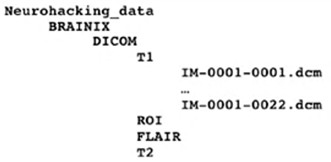
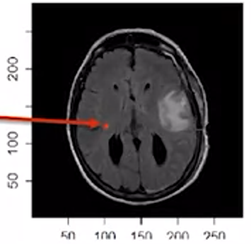
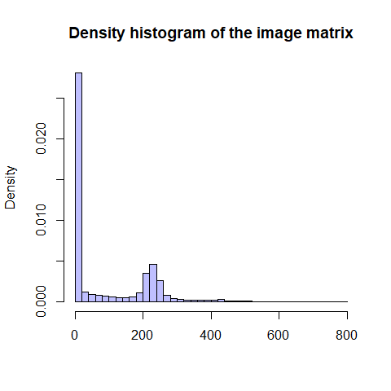

Neuroimaging
================
IO
17 01 2022

# Installing Packages

``` r
# install.packages("oro.nifti")
# install.packages("oro.dicom")
# devtools::install_github("muschellij2/fslr")
# devtools::install_github("stnava/ITKR")
# devtools::install_github("stnava/ANTsR")
# devtools::install_github("muschellij2/extrantsr")
```

## Beyin görsel türleri

### DICOM (Digital Imaging and Communications in Medicine .dcm)

Hastanelerde kullanılan standart görsel türüdür ve PACS (picture
archiving and communication system) dosyalarının formatıdır.

İki componenti vardır;

1.  Görsel datası (pixel)  

-   Pixeller matrix olarak kodlanır  

2.  Meta-data (scanner boyutları, hastane ve hasta bilgileri)

<figure>
<figcaption aria-hidden="true">Her bir DICOM dosyası beynin bir slaytına gelecek şekilde kaydedilir</figcaption>
</figure>

``` r
library(oro.dicom) #dicom dosyalarını okumak için

# Read one slice
slice <- readDICOM("Neurohacking_data-master/BRAINIX/DICOM/FLAIR/IM-0001-0011.dcm")
class(slice)
```

    ## [1] "list"

``` r
# Read all slices
all_slices_T1 <- readDICOM("Neurohacking_data-master/BRAINIX/DICOM/T1/")
dim(all_slices_T1$img[[1]])
```

    ## [1] 512 512

DICOM dosyaları okunduktan sonra büyük bir listenin içinde

1.  header (hdr)

-   data.frame

2.  image (img)

-   matrix

listeleri kaydedilir.

#### Image

``` r
names(slice)
```

    ## [1] "hdr" "img"

``` r
class(slice$img[[1]])
```

    ## [1] "matrix" "array"

``` r
dim(slice$img[[1]])
```

    ## [1] 288 288

Görselleri görmek için bu img matrixinin transposunu aldıktan sonra
bunun boyutlarını (dimensions) `image()` fonksiyonuyla
görselleştirebiliriz.


``` r
d <- dim(t(slice$img[[1]])) #transposunun dimentionalarını kaydet

image(x = 1:d[1], y = 1:d[2], #dimentions in the and y axes
      t(slice$img[[1]]),      #that 1 image in the slice
      col = gray(0:64/64))    #set the color to gray scale
```

<!-- -->

### Görsel Analizi

Bizim yapmaya çalıştığımız görsellerin analizi olduğu için sayılara
bakmamız lazım.

``` r
slice$img[[1]][101:105, #görselin x düzleminde 101 ile 105 voxel aralığı
               121:125] #görselin y düzleminde 121 ile 125 voxel aralığı
```

    ##      [,1] [,2] [,3] [,4] [,5]
    ## [1,]    4   34   36   75  222
    ## [2,]    9   44   33  117  248
    ## [3,]   19   47   54  167  274
    ## [4,]   27   28   98  239  286
    ## [5,]   12   45  170  288  307



Matrixin resimdeki karşılığına baktığımızda açık renkler daha yüksek
sayılara denk geliyor.  
Sayıları başka bir yöntem olarak histogram ile inceleyebiliriz.

``` r
hist(slice$img[[1]][,],    #no slice, everything involved
     breaks= 50,           #every bar in the histogram holds 50 values
     prob = T,             #make it a density histogram, not a frequency
     col = rgb(0,0,1,1/4), #change the colors
     main = "Density histogram of the image matrix",
     xlab = "")
```

<!-- -->

#### Header

Header’ın içinde 7 ayrı bilgi mevcut.

``` r
hdr <- slice$hdr[[1]] #save the dataframe in hdr
class(hdr)
```

    ## [1] "data.frame"

``` r
n_distinct(hdr$name) #125 farklı bilgi var dosyayla ilgili
```

    ## [1] 125

Hangi bilgiler var diye bakalım.

``` r
head(hdr$name, 10)
```

    ##  [1] "GroupLength"                  "FileMetaInformationVersion"  
    ##  [3] "MediaStorageSOPClassUID"      "MediaStorageSOPInstanceUID"  
    ##  [5] "TransferSyntaxUID"            "ImplementationClassUID"      
    ##  [7] "ImplementationVersionName"    "SourceApplicationEntityTitle"
    ##  [9] "SpecificCharacterSet"         "ImageType"

``` r
hdr %>% 
  group_by(name) %>% 
  summarise(count = n()) %>% 
  arrange(desc(count)) %>%
  head(10)
```

    ## # A tibble: 10 x 2
    ##    name                      count
    ##    <chr>                     <int>
    ##  1 Item                          8
    ##  2 ItemDelimitationItem          8
    ##  3 SequenceDelimitationItem      7
    ##  4 ReferencedSOPClassUID         5
    ##  5 ReferencedSOPInstanceUID      5
    ##  6 CodeMeaning                   2
    ##  7 CodeValue                     2
    ##  8 CodingSchemeDesignator        2
    ##  9 ContextGroupExtensionFlag     2
    ## 10 InstanceCreationDate          2

Pixel aralıklarını bulalım.

``` r
hdr[hdr$name == "PixelSpacing", # hdr name sütunu içinde PixelSpacing'e elit olan
    "value"] # satırın value sütunundaki değeri ver
```

    ## [1] "0.79861110448837 0.79861110448837"

Her bir pixel karesinin kenarları .798 x .798 boyutundaymış, görselin
çözünürlüğü (resolution).

Flip angle görselin çekilme parametlerinden birisidir, makale yazarken
method bölümünde belirtilmesi gerekir.

``` r
hdr[hdr$name == "FlipAngle", ] # name sütununda FlipAngle'a eşit olan satırı ver
```

    ##     group element      name code length value sequence
    ## 107  0018    1314 FlipAngle   DS      4  90.0

Bu görsel için flip angle 90 dereceymiş.
