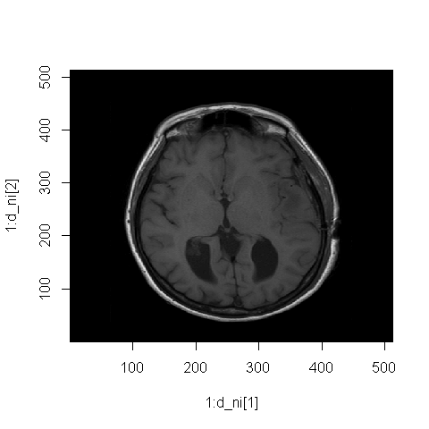

The NIfTI Format
================
IO
22 02 2022

-   [NIfTI (Neuroimaging Informatics Technology
    Initiative)](#nifti-neuroimaging-informatics-technology-initiative)
    -   [Additional info for other
        formats](#additional-info-for-other-formats)
    -   [oro.nifti package](#oronifti-package)
-   [Visualizations](#visualizations)
    -   [Backmapping](#backmapping)
        -   [Backmapping one slice](#backmapping-one-slice)
-   [Basic Data Manipulations](#basic-data-manipulations)
    -   [Follow up of T1](#follow-up-of-t1)
-   [Smoothing](#smoothing)
-   [Basic MRI Contrasts](#basic-mri-contrasts)
    -   [FLAIR (Fluid-attenuated inversion
        recovery)](#flair-fluid-attenuated-inversion-recovery)

## NIfTI (Neuroimaging Informatics Technology Initiative)

Görsel analizi için en çok kullanılan dosya formatıdır. Beyin kesit
görsellerini üst üste koyarak 3 boyutlu bir array verir. DICOM ise birer
kesit olarak kaydedilip birleştirilmez.

DICOM’daki gibi hastane veya hasta ismini NIfTI kayıt etmez ama görsel
metadata bilgileri vardır.

### Additional info for other formats


DICOM dosyalarını NIfTI’ye dönüştürmek için oro.dicom paketinin
`dicom2nifti()` fonksiyonu kullanılır.

``` r
library(dplyr)
library(oro.dicom)

all_slices_T1 <- readDICOM("Neurohacking_data-master/BRAINIX/DICOM/T1/")

hdr_11 <- all_slices_T1$hdr[[11]]
hdr_11[hdr_11$name == "PixelSpacing", "value"]
```

    ## [1] "0.46875 0.46875"

``` r
# for (i in 1:length(all_slices_T1$img)) {
#   assign(x = paste0("img_", i), value = all_slices_T1$img[[i]]) }
```

DICOM’u NIfTI’ye çevirme

``` r
nii_T1 <- dicom2nifti(all_slices_T1) #change all slices to nifti

d <- dim(nii_T1) #get the dimensions of the nifti slices
d
```

    ## [1] 512 512  22

``` r
class(nii_T1)
```

    ## [1] "nifti"
    ## attr(,"package")
    ## [1] "oro.nifti"

``` r
image(x = 1:d[1],
      y = 1:d[2],
      nii_T1[,,13],
      col = gray(0:64/64))
```

<!-- -->

### oro.nifti package

``` r
library(oro.nifti)

writeNIfTI(nim = nii_T1,                   #write this nifti file
           filename = "Output_3D_File_11") #with this name
```

    ## [1] "Output_3D_File_11.nii.gz"

``` r
list.files("Neurohacking_data-master/BRAINIX/NIfTI",
           pattern = "Output_3D_File")
```

    ## [1] "Output_3D_File.nii.gz"    "Output_3D_File_11.nii.gz"

``` r
nii_t1 <- readNIfTI("Neurohacking_data-master/BRAINIX/NIfTI/t1.nii.gz",
                    reorient = F)
dim(nii_t1)
```

    ## [1] 512 512  22

``` r
print(nii_t1)
```

    ## NIfTI-1 format
    ##   Type            : nifti
    ##   Data Type       : 4 (INT16)
    ##   Bits per Pixel  : 16
    ##   Slice Code      : 0 (Unknown)
    ##   Intent Code     : 0 (None)
    ##   Qform Code      : 1 (Scanner_Anat)
    ##   Sform Code      : 1 (Scanner_Anat)
    ##   Dimension       : 512 x 512 x 22
    ##   Pixel Dimension : 0.47 x 0.47 x 6
    ##   Voxel Units     : mm
    ##   Time Units      : sec

Important part is the pixel dimensions which tells us that there are 512
rows and 512 cols in each of the 22 images.

## Visualizations

1.  There is the default version of visualization

``` r
d_ni <- dim(nii_t1)

image(x = 1:d_ni[1],
      y = 1:d_ni[2],
      z = nii_t1[,,11],
      col = gray(0:64/64))
```

<!-- -->

2.  You can also directly use the nifti object

``` r
image(nii_t1)
```

<!-- -->

``` r
image(nii_t1,
      z = 11,
      plot.type = "single")
```

<!-- -->

Now let’s get the image in a nice axial, sagital, and coronal view.

``` r
orthographic(nii_t1, xyz = c(200,  #200 for the x
                             220,  #220 for the y
                             11))  #11 for the z, which is the slice
```

<!-- -->

### Backmapping

Let’s look at a nice histogram. This is part of a thing called back
mapping in which you get some sort of statistics from matrixes of the
image.

``` r
par(mfrow = c(1,2))

hist(nii_t1[,,11][nii_t1[,,11] > 20],
     breaks = 50,
     probability = T,
     xlab = "T1 Intencities",
     main = "Slice 11")

hist(nii_t1[,,13][nii_t1[,,13] > 20],
     breaks = 50,
     probability = T,
     xlab = "T1 Intencities",
     main = "Slice 13")
```

<!-- -->

#### Backmapping one slice

``` r
bw_300_400 <- ((nii_t1 > 300)       # take the value bigger than 300
                  & (nii_t1 < 400)) # and smaller than 400

nii_t1_mask <- nii_t1

nii_t1_mask[!bw_300_400] = NA # assign NA to everything other than bw_300_400

overlay(nii_t1, nii_t1_mask,  # on top of nii_t1, map (overlay) nii_t1_mask 
        z = 11,               # in slice 11
        plot.type = "single") # single image
```

<!-- -->

Yukarıdaki görselde pixel yoğunluğu (intensity) 300 ile 400 arasında
olan bölgeler kırmızı ile işaretlenmiş. Bu yoğunluktaki alanlar da white
matter’a denk gelmektedir.

``` r
overlay(nii_t1, nii_t1_mask)
```

<!-- -->

``` r
orthographic(nii_t1, nii_t1_mask, 
            xyz = c(200, 220, 11),
            text = "Image overlayed with mask",
            text.cex = 1.5)
```

<!-- -->

## Basic Data Manipulations

Addition, substraction, multiplication

``` r
mridir <- "Neurohacking_data-master/Kirby21/visit_1/113"  # set the directory for easy access in the code

t1 <- readNIfTI(file.path(mridir, "113-01-MPRAGE.nii.gz"), 
                reorient = F)
```

``` r
orthographic(t1)
```

<!-- -->

``` r
mask <- readNIfTI(file.path(mridir, "113-01-MPRAGE_mask.nii.gz"), 
                  reorient = F)

orthographic(mask)
```

<!-- -->

Mask is 0 for the things we don’t want and 1 for the things we want, if
we multiply the real image with the mask, all the areas we don’t want
will be 0’ed and all the area we want will be multiplied by 1 (meaning
they will stay as).

``` r
masked_t1 <- t1*mask

orthographic(masked_t1)
```

<!-- -->

One important point is that mask and the T1 image have to be the same
size. (e.g. 512 x 512 x 22 for both)

#### Follow up of T1

This patient had a break in between sessions (maybe went for a coffee
break) and came back to do the rest of the imaging sessions.

``` r
t1.follow <- readNIfTI("Neurohacking_data-master/kirby21/visit_2/113/113-02-MPRAGE.nii.gz")

orthographic(t1.follow)
```

<!-- -->

In a substaction, the operation goes as follow: firstVoxel1 -
followVoxel1, firstVoxel2 - followVoxel2, …

``` r
t1.substacted <- t1.follow - t1
summary(t1.substacted)
```

    ##     Min.  1st Qu.   Median     Mean  3rd Qu.     Max. 
    ## -2155505    -6625        0   -26652     1839  2158811

But the important lesion here is even if two imaging sessions are from
the same person, same machine, same day 30 min apart, the results are
drastically different as it is seen from the min and the max values
above.

``` r
orthographic(t1.substacted)
```

<!-- -->

## Smoothing

Beyin resminde görüntülemeden bağımsız bir şekilde rastgele oluşan
varyanslar (noise) ile başa çıkmak için smoothing yapılır. Bunu da
Gaussian kernel denilen bir formül ile yaparız. Bu formüldeki değer ne
kadar büyükse görüntü o kadar sıvanır ve blurlaşır.

``` r
t1.smooth <- AnalyzeFMRI::GaussSmoothArray(t1,                #t1 array'i
                                           voxdim = c(1,1,1), #voxel boyutları (dimensions)
                                           ksize = 11,        #kernel size
                                           sigma = diag(3,3), #how symmetric the kernel is
                                           mask = NULL,
                                           var.norm = F)

orthographic(t1.smooth)
```

<!-- -->

Fazla smoothing görsel çözünürlüğünü düşürür. Genelde 3-4 farklı kernel
size (e.g., 5, 10, 20) uygulamaları yapılıp görsellerin incelenmesi
sonucunda bir tanesi inceleme türü dikkate alınarak tercih edilir.

Bir görselin içindeki yoğunlukları (intensity) değiştirip farklı bir
görünüme kavuşturmaya transformation denir. Bu da beyaz veya siyah
alanların nasıl görüneceğini (değişeceğini) ayarlamaya yarar.

## Basic MRI Contrasts

### FLAIR (Fluid-attenuated inversion recovery)

FLAIR dosyalarında beyin kanseri gibi anormallikler T1’e kıyasla daha
rahat gözlemlenebilir.

FLAIR image

``` r
flairdir <- "Neurohacking_data-master/BRAINIX/NIfTI"
sequence <- "FLAIR"

volume.flair <- readNIfTI(file.path(flairdir, paste0(sequence, ".nii.gz")), 
                      reorient = F)

volume.flair <- cal_img(volume.flair)

image(volume.flair, 
      z = 12,
      plot.type = "single")
```

<!-- -->

T1 weighted image

``` r
sequence.t1 <- "T1"

volume.t1 <- readNIfTI(file.path(flairdir, paste0(sequence.t1, ".nii.gz")),
                       reorient = F)

volume.t1 <- cal_img(volume.t1)

image(volume.t1, 
      z = 12,
      plot.type = "single")
```

<!-- -->

T2-weighted image

``` r
sequence.t2 <- "T2"

volume.t2 <- readNIfTI(file.path(flairdir, paste0(sequence.t2)),
          reorient = F)

image(volume.t2,
      z = 12,
      plot.type = "single")
```

<!-- -->


Ym(V): intensity of the image V is the particulat voxel of interest m is
the contrast

An MRI sequence and an MRI contrast refer to the same thing.
