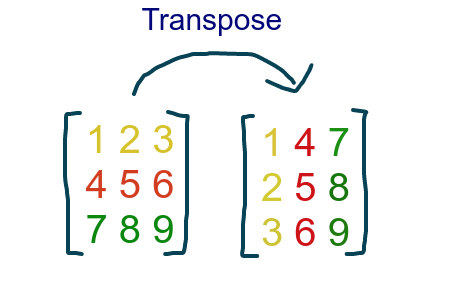

```{r setup, include=FALSE}
knitr::opts_chunk$set(echo = TRUE, warning = F, message = F,
                      fig.width = 5, fig.height = 5)
```

# Installing Packages

```{r}
# install.packages("oro.nifti")
# install.packages("oro.dicom")
# devtools::install_github("muschellij2/fslr")
# devtools::install_github("stnava/ITKR")
# devtools::install_github("stnava/ANTsR")
# devtools::install_github("muschellij2/extrantsr")
```

## Beyin görsel türleri

### DICOM (Digital Imaging and Communications in Medicine .dcm)

Hastanelerde kullanılan standart görsel türüdür ve PACS (picture archiving and communication system) dosyalarının formatıdır.  

İki componenti vardır;

1. Görsel datası (pixel)  
  * Pixeller matrix olarak kodlanır  
2. Meta-data (scanner boyutları, hastane ve hasta bilgileri)

{width=50%}

```{r}
library(dplyr)
library(oro.dicom) #dicom dosyalarını okumak için

# Read one slice
slice <- readDICOM("Neurohacking_data-master/BRAINIX/DICOM/FLAIR/IM-0001-0011.dcm")
class(slice)

# Read all slices
all_slices_T1 <- readDICOM("Neurohacking_data-master/BRAINIX/DICOM/T1/")
dim(all_slices_T1$img[[1]])
``` 


DICOM dosyaları okunduktan sonra büyük bir listenin içinde

1. header (hdr) 
  * data.frame
2. image (img)
  * matrix

listeleri kaydedilir.

#### Image

```{r}
names(slice)
class(slice$img[[1]])
dim(slice$img[[1]])
```

Görselleri görmek için bu img matrixinin transposunu aldıktan sonra bunun boyutlarını (dimensions) `image()` fonksiyonuyla görselleştirebiliriz.

{width=50%}  

```{r}
d <- dim(t(slice$img[[1]])) #transposunun dimentionalarını kaydet

image(x = 1:d[1], y = 1:d[2], #dimentions in the and y axes
      t(slice$img[[1]]),      #that 1 image in the slice
      col = gray(0:64/64))    #set the color to gray scale
```

### Görsel Analizi

Bizim yapmaya çalıştığımız görsellerin analizi olduğu için sayılara bakmamız lazım.

```{r matrix voxel aralığı}
slice$img[[1]][101:105, #görselin x düzleminde 101 ile 105 voxel aralığı
               121:125] #görselin y düzleminde 121 ile 125 voxel aralığı
```

{width=50%}

Matrixin resimdeki karşılığına baktığımızda açık renkler daha yüksek sayılara denk geliyor.  
Sayıları başka bir yöntem olarak histogram ile inceleyebiliriz.

```{r histogram}
hist(slice$img[[1]][,],    #no slice, everything involved
     breaks= 50,           #every bar in the histogram holds 50 values
     prob = T,             #make it a density histogram, not a frequency
     col = rgb(0,0,1,1/4), #change the colors
     main = "Density histogram of the image matrix",
     xlab = "")
```

#### Header

Header'ın içinde 7 ayrı bilgi mevcut.

```{r}
hdr <- slice$hdr[[1]] #save the dataframe in hdr
class(hdr)

n_distinct(hdr$name) #125 farklı bilgi var dosyayla ilgili
```

Hangi bilgiler var diye bakalım.

```{r}
head(hdr$name, 10)
```

```{r}
hdr %>% 
  group_by(name) %>% 
  summarise(count = n()) %>% 
  arrange(desc(count)) %>%
  head(10)
```

Pixel aralıklarını bulalım.

```{r}
hdr[hdr$name == "PixelSpacing", # hdr name sütunu içinde PixelSpacing'e elit olan
    "value"] # satırın value sütunundaki değeri ver
```

Her bir pixel karesinin kenarları .798 x .798 boyutundaymış, görselin çözünürlüğü (resolution).  

Flip angle görselin çekilme parametlerinden birisidir, makale yazarken method bölümünde belirtilmesi gerekir.

```{r}
hdr[hdr$name == "FlipAngle", ] # name sütununda FlipAngle'a eşit olan satırı ver
```

Bu görsel için flip angle 90 dereceymiş.
