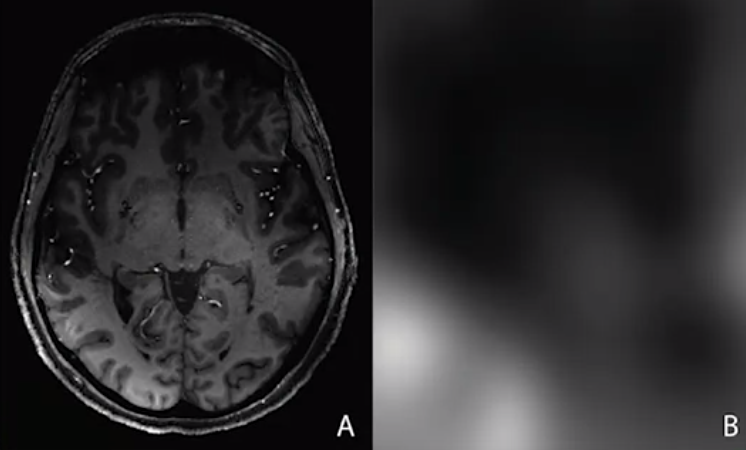
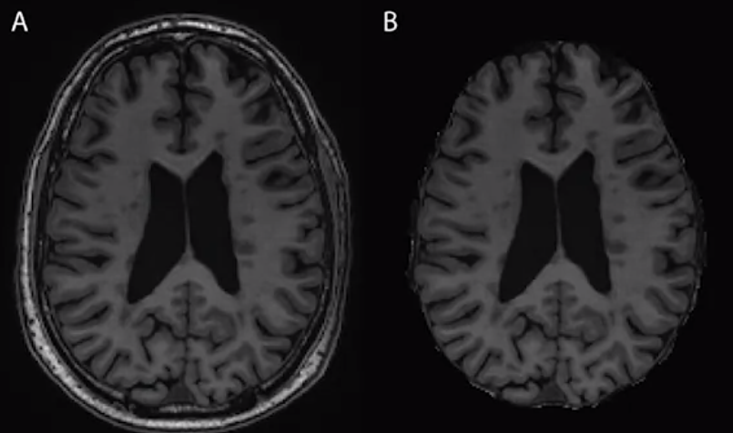
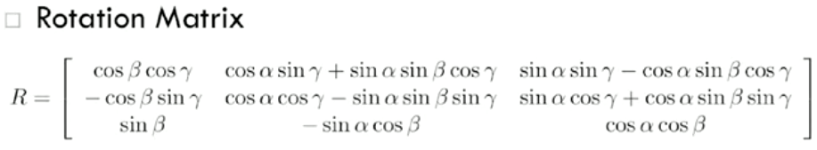
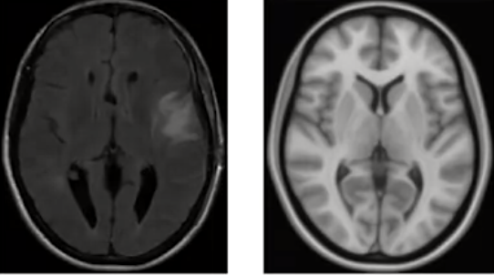

Preprocessing
================
IO
2/25/2022

-   [Preprocessing](#preprocessing)
    -   [1. Inhomogeneity correction
        (Smoothing)](#1-inhomogeneity-correction-smoothing)
    -   [2. Skull stripping](#2-skull-stripping)
    -   [3. Registration](#3-registration)
        -   [Types of registarion](#types-of-registarion)
            -   [Complexity](#complexity)
                -   [Rigid](#rigid)
                -   [Affine](#affine)
                -   [Nonlinear](#nonlinear)
            -   [Co-registration (within the same
                person)](#co-registration-within-the-same-person)
            -   [Registration to a
                template](#registration-to-a-template)

## Preprocessing

Tarayıcıdan alınan görselleri analiz işlemini için hazırlamaya denir.
Birkaç adımı vardır ve bunları ardı ardına yapma işlemine pipeline
denir.

1.  Inhomogeneity (e.g., N3) correction
2.  Spatial interpolation
3.  Skull stripping
4.  Spatial registration
5.  Rigid and affine registration
6.  Non-linear registration
7.  Intensity normalization

### 1. Inhomogeneity correction (Smoothing)

Tarayıcı kaynaklı hatalardan (noise) dolayı görsel içerisinde homojen,
yani görselin her yerinde aynı olan bölgeler için eşit bir görüntü
olmaması. Bu, büyük ihtimalle tarayıcının içindeki manyetik alanın
homojen olmamasından kaynaklanır.

<figure>
<figcaption aria-hidden="true">A: not corrected, B: biased field</figcaption>
</figure>

A görselinin sol alt kısmında bir hatadan dolayı oluşan daha parlak bir
alan var ve bunun düzeltimesi gerekiyor.  
B görselinde ise bir yanlı alan (biased field) görüyoruz; gerçekte iki
kısım da aynı olmasına rağmen yukarıdaki siyahlıklar aşağıdaki
siyahlıklardan daha koyu.

Bunun için smoothing yapılması gerekir (e.g., N3 algoritması ile).
[NIfTI
kısmındaki](https://github.com/IsmetOzzer/Neuroimaging/blob/main/2-nifti.md#smoothing)
`AnalyzeFMRI::GaussSmoothArray()` fonksiyonu kullanılır. Farklı kernel
size’lar deneyip farklı resimleri incelemek gerekir.

### 2. Skull stripping

Beyin dokusu olmayan her yerin görselden çıkarma işlemidir. Analizin
daha sağlıklı ve net olması için yapılır.

### 3. Registration

Birden fazla görseller için (between or within subjects olabilir)
beyinlerin hepsinde aynı voxelleri birbiriyle eşitlemek için yapılır.
Beyin görselini döndürerek (rotation) ve voxel sayı değerlerine bir
sayısal ağırlık uygulayarak (translation) eşitlemeye çalışırız.
Özellikle farklı beyinler için bunu mükemmel yapmak imkansızdır ama yine
de bu adımı atmak analizin sağlığı için gereklidir.

#### Types of registarion

##### Complexity

Bir görseli diğer bir görsel ile eşitlemek için ne kadar deformasyona
maruz bırakacağımızı degrees of freedom (df) cinsinden belirtir. 3
farklı (df ile) complexity registration metodu vardır:

###### Rigid

Görsel matrix’ini değiştiren (translation: 3 boyutta değişim yapabilen
*t**x*, *t**y*, *t**z* vektörü) ve
döndüren (rotation: 3 boyutlu döndürmek için uygulanan cos ve sin
işlemlerini içeren karışık matrix) 6 df’li linear bir registration
yöntemidir. Yani görseli döndürdükten sonra voxel değerlerine ağırlık
atayarak bir çeşit değişim ile (translation: görselin matrix değerlerine
belli bir ekleme yapmak) eşitlemeye çalışır.

<figure>
<figcaption aria-hidden="true">her bir sütunda belirtilen işlemlerden v voxel’inin x,y,z değerlerine uygulanacak birer tane formül seçilir</figcaption>
</figure>

> *T**r**i**g**i**t*(*v*) = *R**v* + *t*

*T**r**i**g**i**d*(*v*): (Her bir) v voxelinde yapılacak
rigid transformasyonu  
v: 3 boyutlu beyin görselinde belirtilen v voxeli  
R: Uygulanacak rotasyonun değerlerini barındıran matrix  
*R**v*: Rotasyon matrix değerlerinin v voxeli ile çarpımı (R
\* v)  
t = Uygulanacak translasyon işlemi için değerleri barındıran vektör (v
voxelinin x,y,z değerleri için 3 boyutu vardır)

“Her bir voxel’i rotasyon matrixindeki değerlerle çarp ve translasyon
vektöründeki değerlerini ekle” demektir.

###### Affine

Translasyon (3 sayılı bir vektör) ile illa rotation işlemi yapmak
zorunda olmayan affine matrixi (3x3 = 9 girdili bir matrix) ile birlikte
12 df’li bir linear complexity registration metodudur.

> *T**a**f**f**i**n**e*(*v*) = *A**v* + *t*

*T**a**f**f**i**n**e*(*v*): (Her bir) v voxeli için yapılacak
affine transformasyonu  
v: 3 boyutlu beyin görselinde belirtilen v voxeli  
A: Uygulanacak işlemin (rotasyon olmak zorunda değil) değerlerini
barındıran 3x3 botundaki matrix  
*A**v*: Uygulancak işlemin matrix değerleri ile voxelin
değelerinin çarpımı (A \* v)  
t: Uygulanacak translasyon işlemi için değerleri barındıran vektör (v
voxelinin x,y,z değerleri için 3 boyutu vardır)

###### Nonlinear

Diyelim ki iki beyni eşleştirmek istiyoruz ama beyinlerin birisinde
tümörlü bir bölüm var. Bu tümör beynin fiziksel yapısını bozduğu için
sadece tümörsüz olan kısımları birbiriyle eşleştirmek istersek linear
olmayan bir eşleştirme yöntemi kullanmamız gerekir. Bu tür linear
olmayan eşleştirmeler registration, co-registration veya from a template
yöntemleri için de kullanılabilir.

##### Co-registration (within the same person)

Bir kişinin beyninin görsellerini değişik koşullarda eşitlemeye denir.
Klinik vakalarda kullanımı yaygındır. Bu tür eşleştirmeler hem daha iyi
çalışır hem de daha az df gerektirir.

-   Cross-sectional between-modalities:
-   Longitudinal within-modality: (1. ziyaretteki T1) ile (2.
    ziyaretteki T1)
-   Longitudinal between-modalities: (1. ziyaretteki T1) ile (2.
    ziyaretteki FLAIR)

Bu yöntemle template kullanılmadan yapılabilen analizlere 2 örnek:

-   Beynin belli bir bölgesindeki uzun soluklu (6 ay arayla yapılan 2
    görüntüleme arasındaki) değişimleri incelemek için (e.g., yayılan
    bir tümörün etkilediği alanları incelemek) sadece bölümün görüntüsü
    üzerinden analiz yapmak için template kullanmaya gerek yoktur.
-   Segmentasyon: Beyindeki beyaz ve gri madde alanlarını veya bir
    görselin içinde farklı iki bölgeyi ölçüp (belki intensity’lerini)
    karşılaştırmak için bir template kullanmaya gerek yoktur.

##### Registration to a template

Görselleri belli bir tamplate üzerinde eşitlemeye denir ve en popüler
registration yöntemidir. Konumların (voxeller, ROI’ler) aynı veya benzer
yorumlara sahip olmasını sağlamak amacıyla bir veya birden fazla
görüntünün uzamsal dönüşümüdür (spatial transformation). En popüler
olarak kullanılan tamplate ise MNI tamplate’idir ama beyindeki biyolojik
bölgeler hakkında az bilgi barındırır.

Bir beyin görüntüsüne bakarken bile belli bölgereli (cerebellum) kendi
zihnimizdeki template ile karşılaştırırız.

Elimizdeki beyin görselini belli bir template’e kaydetmemizi gerektiren
durumlara örnekler:

-   Popülasyonlar arası analizler
    -   Alzheimer hastalarında sağlıklılara göre beyindeki lezyonlar
    -   “ICH (intra cerebral hemorraige) covered more than 30% of the
        thalamus in 50% of the patients” gibi bölgelerdeki sayısal
        analizler
