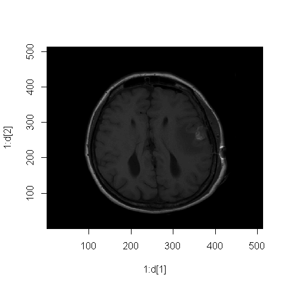
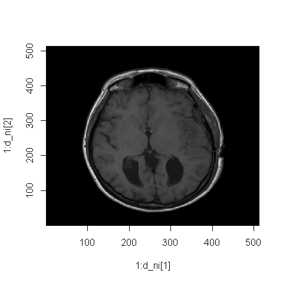
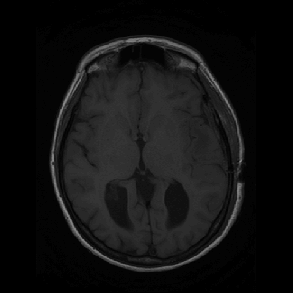
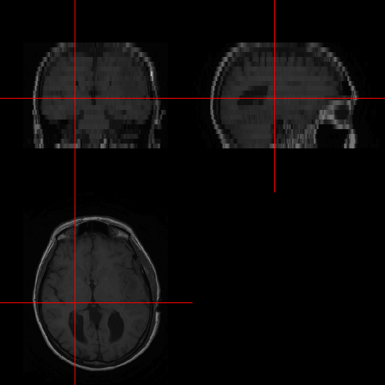
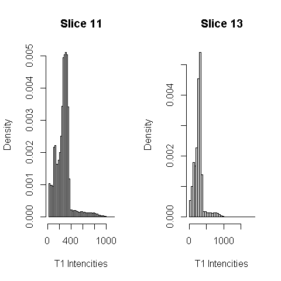
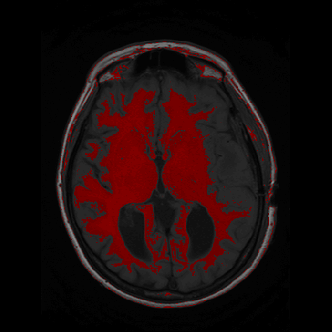
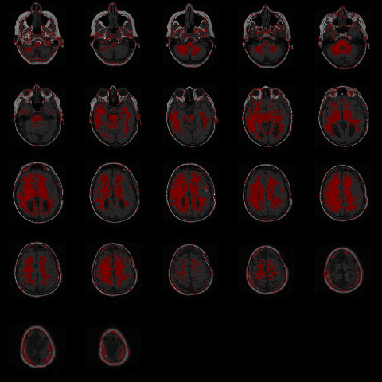
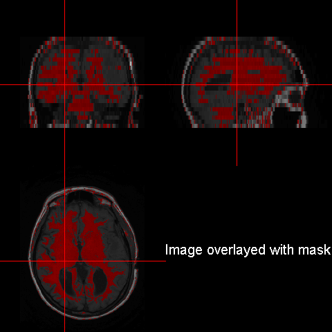

The NIfTI Format
================
IO
22 02 2022

## NIfTI (Neuroimaging Informatics Technology Initiative)

Görsel analizi için en çok kullanılan dosya formatıdır. Beyin kesit
görsellerini üst üste koyarak 3 boyutlu bir array verir. DICOM ise birer
kesit olarak kaydedilip birleştirilmez.

DICOM’daki gibi hastane veya hasta ismini NIfTI kayıt etmez ama görsel
metadata bilgileri vardır.

DICOM dosyalarını NIfTI’ye dönüştürmek için oro.dicom paketinin
`dicom2nifti()` fonksiyonu kullanılır.

``` r
library(dplyr)
library(oro.dicom)

all_slices_T1 <- readDICOM("Neurohacking_data-master/BRAINIX/DICOM/T1/")

hdr_11 <- all_slices_T1$hdr[[11]]
hdr_11[hdr_11$name == "PixelSpacing", "value"]
```

    ## [1] "0.46875 0.46875"

``` r
# for (i in 1:length(all_slices_T1$img)) {
#   assign(x = paste0("img_", i), value = all_slices_T1$img[[i]]) }
```

DICOM’u NIfTI’ye çevirme

``` r
nii_T1 <- dicom2nifti(all_slices_T1) #change all slices to nifti

d <- dim(nii_T1) #get the dimensions of the nifti slices
d
```

    ## [1] 512 512  22

``` r
class(nii_T1)
```

    ## [1] "nifti"
    ## attr(,"package")
    ## [1] "oro.nifti"

``` r
image(x = 1:d[1],
      y = 1:d[2],
      nii_T1[,,13],
      col = gray(0:64/64))
```

<!-- -->

### oro.nifti package

``` r
library(oro.nifti)

writeNIfTI(nim = nii_T1,                   #write this nifti file
           filename = "Output_3D_File_11") #with this name
```

    ## [1] "Output_3D_File_11.nii.gz"

``` r
list.files("Neurohacking_data-master/BRAINIX/NIfTI",
           pattern = "Output_3D_File")
```

    ## [1] "Output_3D_File.nii.gz"    "Output_3D_File_11.nii.gz"

``` r
nii_t1 <- readNIfTI("Neurohacking_data-master/BRAINIX/NIfTI/t1.nii.gz",
                    reorient = F)
dim(nii_t1)
```

    ## [1] 512 512  22

``` r
print(nii_t1)
```

    ## NIfTI-1 format
    ##   Type            : nifti
    ##   Data Type       : 4 (INT16)
    ##   Bits per Pixel  : 16
    ##   Slice Code      : 0 (Unknown)
    ##   Intent Code     : 0 (None)
    ##   Qform Code      : 1 (Scanner_Anat)
    ##   Sform Code      : 1 (Scanner_Anat)
    ##   Dimension       : 512 x 512 x 22
    ##   Pixel Dimension : 0.47 x 0.47 x 6
    ##   Voxel Units     : mm
    ##   Time Units      : sec

Important part is the pixel dimensions which tells us that there are 512
rows and 512 cols in each of the 22 images.

## Visualizations

1.  There is the default version of visualization

``` r
d_ni <- dim(nii_t1)

image(x = 1:d_ni[1],
      y = 1:d_ni[2],
      z = nii_t1[,,11],
      col = gray(0:64/64))
```

<!-- -->

2.  You can also directly use the nifti object

``` r
image(nii_t1)
```

<!-- -->

``` r
image(nii_t1,
      z = 11,
      plot.type = "single")
```

<!-- -->

Now let’s get the image in a nice axial, sagital, and coronal view.

``` r
orthographic(nii_t1, xyz = c(200,  #200 for the x
                             220,  #220 for the y
                             11))  #11 for the z, which is the slice
```

<!-- -->

### Backmapping

Let’s look at a nice histogram. This is part of a thing called back
mapping in which you get some sort of statistics from matrixes of the
image.

``` r
par(mfrow = c(1,2))

hist(nii_t1[,,11][nii_t1[,,11] > 20],
     breaks = 50,
     probability = T,
     xlab = "T1 Intencities",
     main = "Slice 11")

hist(nii_t1[,,13][nii_t1[,,13] > 20],
     breaks = 50,
     probability = T,
     xlab = "T1 Intencities",
     main = "Slice 13")
```

<!-- -->

#### Backmapping one slice

``` r
bw_300_400 <- ((nii_t1 > 300)       # take the value bigger than 300
                  & (nii_t1 < 400)) # and smaller than 400

nii_t1_mask <- nii_t1

nii_t1_mask[!bw_300_400] = NA # assign NA to everything other than bw_300_400

overlay(nii_t1, nii_t1_mask,  # on top of nii_t1, map (overlay) nii_t1_mask 
        z = 11,               # in slice 11
        plot.type = "single") # single image
```

<!-- -->

Yukarıdaki görselde pixel yoğunluğu (intensity) 300 ile 400 arasında
olan bölgeler kırmızı ile işaretlenmiş. Bu yoğunluktaki alanlar da white
matter’a denk gelmektedir.

``` r
overlay(nii_t1, nii_t1_mask)
```

<!-- -->

``` r
orthographic(nii_t1, nii_t1_mask, 
            xyz = c(200, 220, 11),
            text = "Image overlayed with mask",
            text.cex = 1.5)
```

<!-- -->

### Additional info for other formats


